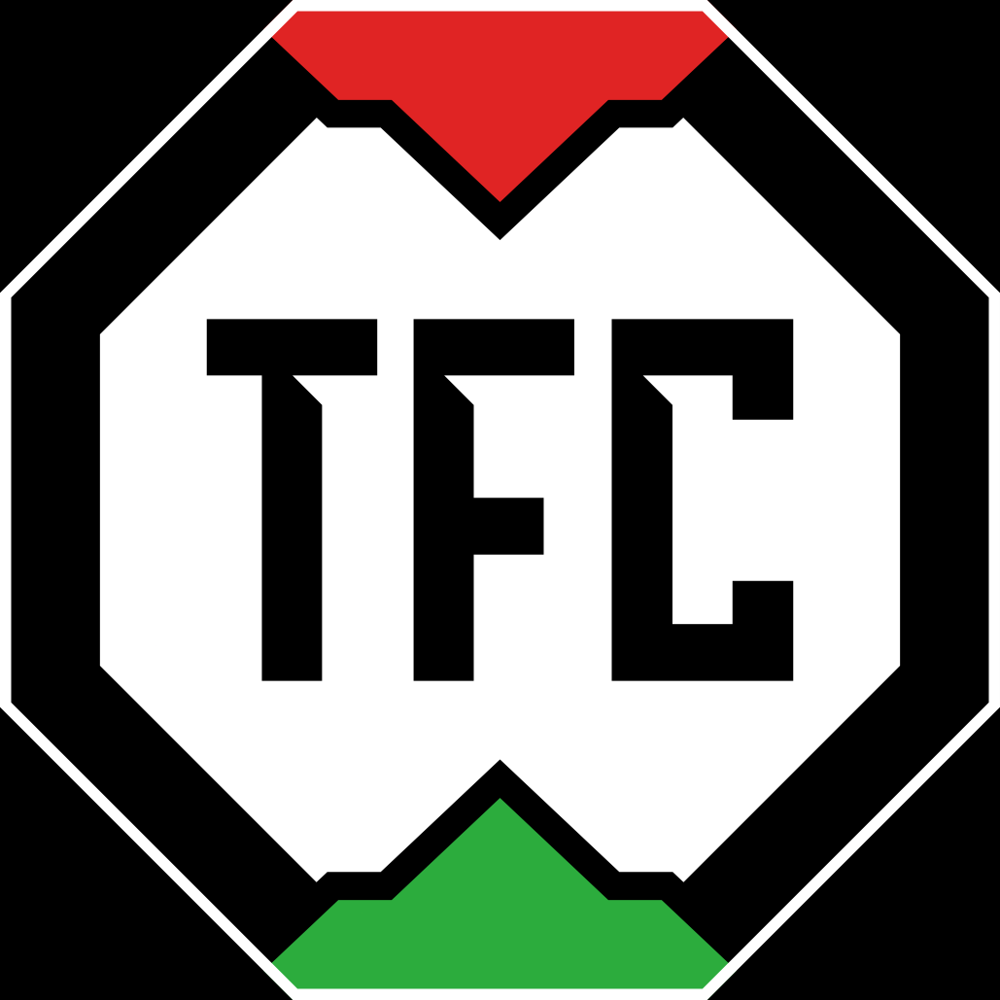

 
    

<h1 align="center"> TradingFight.club </h1>
Trading Fight.club (TFC) is an opensource financial social network. 

## 🎨 Design

Design by [Henrique Carvalho](https://www.linkedin.com/in/henrique-carvalho-3b001468/). 
Unfortunately he abandoned the project, but I duplicated the figma file and let's following his style, at least for now :)

https://www.figma.com/file/4F3GmpOJMa0ew3jEWPNCTy/Trade-Fight-Club

## 🤝 Contributing

Contributions are what make the open source community such an amazing place to be learn, inspire, 
and create. Any contributions you make are **greatly appreciated**.

1. Open an issue first to discuss what you would like to change.
2. Fork the Project
3. Create your feature branch (`git checkout -b feature/amazing-feature`)
4. Commit your changes (`git commit -m 'Add some amazing feature'`)
5. Push to the branch (`git push origin feature/amazing-feature`)
6. Open a pull request

Please make sure to update tests as appropriate.

## ✍️ Authors

👤 **victorhvs**

Feel free to ping me 😉
