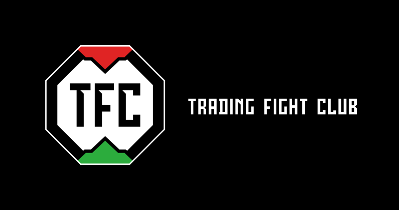
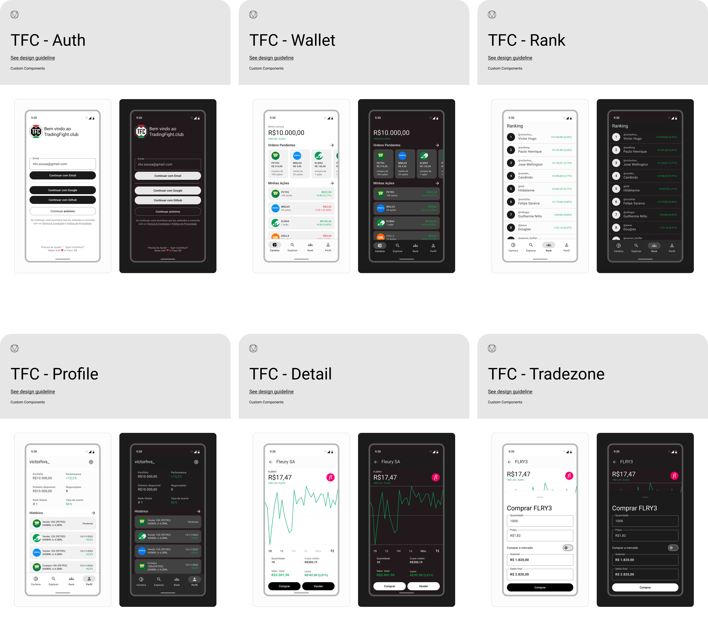

 
    

#
TradingFight.club (TFC) is an opensource financial social network. 

## ✅ MVP Features
- [x] Initial Setup
- [x] Splash
- [x] Home
- [x] Stocks
- [x] Ranking
- [x] Profile
- [x] Stock Detail
- [x] Search
- [x] Testing
- [ ] Google Play
- [x] Github Actions for CI/CD

## 🎨 Design
🔗 https://www.figma.com/file/iOI0Y6IrtrzwxSTVhuDqez/%5BM3%5D-Trading-Fight-Club

 
    
   MVP Screens

## 🤝 Contributing!

Contributions are what make the open source community such an amazing place to be learn, inspire, 
and create. Any contributions you make are **greatly appreciated**.

1. Open an issue first to discuss what you would like to change.
2. Fork the Project
3. Create your feature branch (`git checkout -b feature/amazing-feature`)
4. Commit your changes (`git commit -m 'Add some amazing feature'`)
5. Push to the branch (`git push origin feature/amazing-feature`)
6. Open a pull request

Please make sure to update tests as appropriate.

## ✍️ Authors

👤 **victorhvs**

Feel free to ping me 😉
